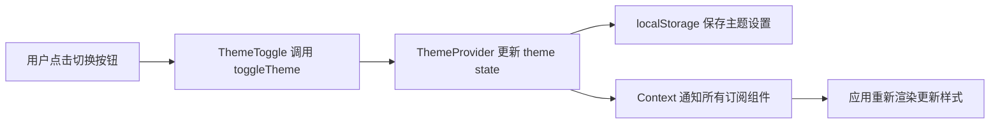

## Product Overview

为 Markdown2Slide 应用添加主题切换功能，支持深色和浅色两种主题模式，提供便捷的 UI 切换器和持久化存储。

## Core Features

- 支持浅色主题和深色主题（3Blue1Brown 风格）两种模式
- 在 Header 右侧添加主题切换按钮
- 主题状态通过 localStorage 持久化
- 切换时带有平滑的过渡动画
- 全局主题状态管理

## Tech Stack

- 前端框架: React + TypeScript
- 样式方案: Tailwind CSS
- 状态管理: React Context API
- 数据持久化: localStorage

## Tech Architecture

### System Architecture

采用 Context + Hooks 的架构模式，实现全局主题状态管理和切换功能。

### Module Division

- **ThemeContext**: 提供主题状态和切换方法的全局上下文
- **ThemeProvider**: 包装应用根组件，提供主题上下文
- **ThemeToggle**: Header 右侧的主题切换按钮组件
- **useTheme**: 自定义 Hook，便捷访问主题状态

### Data Flow



## Implementation Details

### Core Directory Structure

```
src/
├── components/
│   └── ThemeToggle.tsx       # 新增: 主题切换按钮组件
├── context/
│   └── ThemeContext.tsx      # 新增: 主题上下文和 Provider
├── hooks/
│   └── useTheme.ts           # 新增: 主题状态 Hook
├── types/
│   └── theme.ts              # 新增: 主题类型定义
└── utils/
    └── storage.ts            # 修改: 添加 localStorage 工具函数
```

### Key Code Structures

**ThemeType**: 定义主题类型，支持浅色和深色两种模式。

```typescript
export type Theme = 'light' | 'dark';
```

**ThemeContext**: 提供全局主题状态和切换方法的上下文。

```typescript
interface ThemeContextType {
  theme: Theme;
  toggleTheme: () => void;
}
```

### Technical Implementation Plan

1. **主题上下文实现**: 创建 ThemeProvider 使用 React Context API 管理全局主题状态
2. **持久化存储**: 初始化时从 localStorage 读取主题设置，切换时自动保存
3. **主题切换组件**: 设计 SVG 图标按钮，点击切换主题，带有平滑过渡动画
4. **Tailwind 配置**: 定义深色和浅色两套配色方案
5. **全局样式应用**: 在根元素动态添加 dark class，触发 Tailwind 的 dark mode

### Integration Points

- Header 组件集成 ThemeToggle 组件
- App 根组件包裹 ThemeProvider
- localStorage 作为持久化存储方案

## Design Style

采用极简现代风格，通过微交互提供流畅的用户体验。主题切换按钮设计为圆形图标按钮，位于 Header 右侧，带有悬停效果和点击动画。深色主题采用 3Blue1Brown 风格，使用深邃的蓝色调；浅色主题采用清爽的白色和浅灰色调。主题切换时，整个应用通过 CSS transition 实现平滑的颜色过渡效果。

## Agent Extensions

### SubAgent

- **code-explorer**
- Purpose: 探索项目结构，了解现有技术栈和代码组织
- Expected outcome: 明确当前项目的技术框架、组件结构和样式配置，为功能集成提供依据