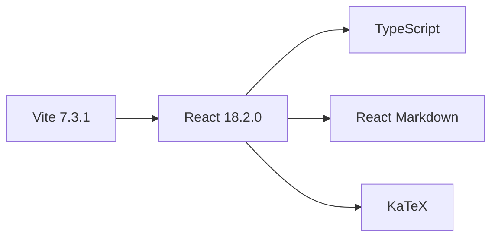

<div align="center">


# Md2Slide


### 🎨 3Blue1Brown 风格幻灯片生成器

**用 Markdown 快速创建精美的数学与技术演示文稿**

[](https://github.com/alleyf/md2slide)
[](https://github.com/alleyf/md2slide)
[](https://github.com/alleyf/md2slide/issues)
[](https://github.com/alleyf/md2slide/pulls)

[在线演示](https://md2-slide.vercel.app/) • [快速开始](#-快速开始) • [使用指南](#-使用指南) • [部署指南](#-部署指南)


</div>


---

## ✨ 特性概览

| 特性 | 描述 | 状态 |
|------|------|------|
| 🎨 **3Blue1Brown 视觉风格** | 深色背景、明亮配色与优雅的排版 | ✅ 已实现 |
| ⚡ **实时预览** | 左侧编辑 Markdown，右侧实时更新幻灯片 | ✅ 已实现 |
| 🌓 **主题切换** | 深色/浅色主题一键切换，持久化保存 | ✅ 已实现 |
| 📊 **数学公式支持** | 完美集成 LaTeX，支持块级和行内公式 | ✅ 已实现 |
| 💻 **代码语法高亮** | 内置多种编程语言的代码展示支持 | ✅ 已实现 |
| 🎬 **视频和图片** | 居中显示，响应式布局 | ✅ 已实现 |
| 🎮 **动态交互** | 支持内容逐步显示（Click-to-reveal）和键盘导航 | ✅ 已实现 |
| 📥 **一键导入** | 支持导入本地 `.md` 和 `.html` 文件 | ✅ 已实现 |
| 🚀 **一键部署** | 支持 Vercel、Netlify 等平台快速部署 | ✅ 已实现 |
| 🎭 **自动动画** | 跨幻灯片元素智能匹配与过渡动画 | ✅ 已实现 |
| 🔌 **插件系统** | 支持第三方插件扩展功能 | ✅ 已实现 |

### 核心功能展示

```markdown
# 梯度下降算法
## 核心概念
寻找函数最小值的迭代方法

### 公式表示
$$\theta = \theta - \alpha \cdot \nabla J(\theta)$$

其中：
- $\theta$ 是参数
- $\alpha$ 是学习率
- $\nabla J(\theta)$ 是梯度

!icon(📉)
```

### HTML 导入示例

你也可以直接导入 HTML 文件并将其嵌入到幻灯片中：

```html
!html(
<div style="text-align: center; padding: 20px;">
  <h2>嵌入的 HTML 内容</h2>
  <p>这是从外部 HTML 文件导入的内容</p>
  <button style="padding: 10px 20px; background: #3498db; color: white; border: none; border-radius: 4px;">
    交互按钮
  </button>
</div>
)
```

> **渲染效果**：
> - 美观的数学公式渲染
> - 列表项逐步显示动画
> - 精致的图标装饰

---

## 📸 预览截图

### 深色主题


```
┌─────────────────────────────────────┐
│  ☀️ md2slide                        │
├─────────────────┬───────────────────┤
│                 │                   │
│   Markdown 编辑  │   幻灯片预览       │
│                 │                   │
│  # 标题         │  ┌─────────────┐ │
│  ---            │  │   标题      │ │
│  - 列表         │  └─────────────┘ │
│                 │                   │
│                 │  • 列表项1       │
│                 │  • 列表项2       │
└─────────────────┴───────────────────┘
```

### 浅色主题


```
┌─────────────────────────────────────┐
│  🌙 md2slide                        │
├─────────────────┬───────────────────┤
│                 │                   │
│   Markdown 编辑  │   幻灯片预览       │
│                 │   (明亮配色)      │
│                 │                   │
└─────────────────┴───────────────────┘
```

---

## 🚀 快速开始

### 环境要求

- **Node.js**: >= 18.0.0
- **npm**: >= 8.0.0 或 **yarn**: >= 1.22.0
- **Git**: >= 2.0.0

### 安装步骤

#### 1. 克隆项目

```bash
# 使用 HTTPS
git clone https://github.com/alleyf/md2slide.git

# 使用 SSH
git clone git@github.com:alleyf/md2slide.git

# 进入项目目录
cd md2slide
```

#### 2. 安装依赖

```bash
# 使用 npm
npm install

# 使用 yarn
yarn install

# 使用 pnpm
pnpm install
```

#### 3. 启动开发服务器

```bash
npm run dev
```

启动后，访问 `http://localhost:3000` 即可开始创作！

### 构建生产版本

```bash
# 构建项目
npm run build

# 预览生产构建
npm run preview
```

---

## 📖 使用指南

### Markdown 语法速查

| 语法 | 用途 | 示例 | 渲染效果 |
|------|------|------|----------|
| `# 标题` | 一级标题 | `# 演示标题` | 大标题 |
| `## 标题` | 二级标题 | `## 副标题` | 副标题 |
| `---` | 幻灯片分隔符 | `---` | 新页面 |
| `- 列表` | 无序列表 | `- 第一点` | • 第一点 |
| `$$公式$$` | 块级公式 | `$$a^2+b^2=c^2$$` | 数学公式 |
| `$公式$` | 行内公式 | `$x=1$` | 行内公式 |
| `!icon(😊)` | 图标 | `!icon(🚀)` | 🚀 |
| `!video(url)` | 视频 | `!video(link.mp4)` | 播放器 |
| `` | 图片 | `` | 图片 |

### 幻灯片结构示例

```markdown
# 第一页幻灯片

这是开场白内容

---

# 第二页幻灯片

## 副标题

- 重点 1
- 重点 2
- 重点 3

$$
\int_{-\infty}^{\infty} e^{-x^2} dx = \sqrt{\pi}
$$

---

# 第三页幻灯片

## 代码示例

\`\`\`python
def hello():
    print("Hello, World!")
\`\`\`

!icon(🎉)
```

### 高级功能

#### 1. 数学公式

**行内公式**：
```markdown
勾股定理：$a^2 + b^2 = c^2$
```

**块级公式**：
```markdown
$$
\int_{-\infty}^{\infty} e^{-x^2} dx = \sqrt{\pi}
$$
```

**支持的 LaTeX 命令**：
- 基础运算：`+`, `-`, `*`, `/`, `^`, `_`
- 函数：`\frac`, `\sqrt`, `\sum`, `\int`
- 矩阵：`\begin{pmatrix} ... \end{pmatrix}`
- 希腊字母：`\alpha`, `\beta`, `\theta`, `\pi`

#### 2. 代码高亮

```markdown
\`\`\`python
def gradient_descent(X, y, theta, alpha, iterations):
    m = len(y)
    for i in range(iterations):
        prediction = X.dot(theta)
        errors = prediction - y
        gradients = (1/m) * X.T.dot(errors)
        theta = theta - alpha * gradients
    return theta
\`\`\`
```

#### 3. 图片和视频

```markdown
# 图片


# 视频
!video(https://www.w3schools.com/html/mov_bbb.mp4)
```

#### 4. 自定义 HTML

```markdown
!html(<div style="color: red;">红色文字</div>)
```

#### 5. 自动动画 (Auto-Animation)

在元素上添加注释来启用自动动画，实现跨幻灯片的平滑过渡：

```markdown
<!-- auto-animate -->
# 标题 1

<!-- auto-animate: type=move, duration=800 -->
- 列表项 1
- 列表项 2

<!-- data-id: unique-element -->
这是一个在多个幻灯片间保持连续性的元素
```

支持的参数：
- `type`: move, scale, fade, transform
- `duration`: 动画持续时间（毫秒）
- `easing`: 缓动函数

#### 6. 插件系统

通过插件系统扩展功能，如代码执行、图表生成等：

```markdown
# 可执行代码块示例

```js {run}
console.log('Hello, World!');
```

点击“Run”按钮执行代码并查看结果。
```

---

## 🎮 交互操作

### 键盘快捷键

| 快捷键 | 功能 |
|--------|------|
| `空格` 或 `→` | 下一步 / 下一页 |
| `←` | 上一步 / 上一页 |
| `点击` | 逐步显示内容 |

### 主题切换

点击右上角的 ☀️/🌙 图标即可切换深色/浅色主题，主题偏好会自动保存到本地存储。

---

## 🔧 技术栈

### 前端框架



### 核心依赖

| 包名 | 版本 | 用途 |
|------|------|------|
| React | ^18.2.0 | UI 框架 |
| Vite | ^7.3.1 | 构建工具 |
| React-Markdown | ^10.1.0 | Markdown 解析 |
| KaTeX | ^0.16.27 | 数学公式渲染 |
| React-Syntax-Highlighter | ^16.1.0 | 代码高亮 |
| Lucide-React | ^0.562.0 | 图标库 |
| Emotion | ^11.14.0 | 样式管理 |
| Remotion | ^4.0.0 | 视频导出 |

### 开发工具

| 包名 | 用途 |
|------|------|
| TypeScript | 类型检查 |
| ESLint | 代码规范 |
| Prettier | 代码格式化 |
| Vitest | 单元测试 |

---

## 🚀 部署指南


[](https://vercel.com/new/clone?repository-url=https%3A%2F%2Fgithub.com%2FAlleyf%2FMd2Slide&project-name=Md2Slide&repository-name=Md2Slide)
&nbsp;&nbsp;
[](https://app.netlify.com/start/deploy?repository=https://github.com/Alleyf/Md2Slide)


### 一键部署到 Vercel

#### 方式一：通过 GitHub 自动部署（推荐）

1. **推送代码到 GitHub**

```bash
git add .
git commit -m "Initial commit"
git branch -M main
git remote add origin https://github.com/alleyf/md2slide.git
git push -u origin main
```

2. **连接到 Vercel**

- 访问 [vercel.com](https://vercel.com)
- 点击 "New Project"
- 选择 GitHub 仓库 `md2slide`
- 点击 "Import"

3. **配置部署设置**

```
Framework Preset: Vite
Root Directory: ./
Build Command: npm run build
Output Directory: dist
Install Command: npm install
```

4. **点击 "Deploy"**

几秒钟后，您的幻灯片应用就会上线！🎉

#### 方式二：使用 Vercel CLI

```bash
# 安装 Vercel CLI
npm i -g vercel

# 登录
vercel login

# 部署
vercel

# 生产环境部署
vercel --prod
```

---

### 部署到 Netlify

#### 方式一：通过 GitHub 自动部署

1. 访问 [app.netlify.com](https://app.netlify.com)
2. 点击 "Add new site" → "Import an existing project"
3. 选择 GitHub 仓库
4. 配置构建设置：

```
Build command: npm run build
Publish directory: dist
```

5. 点击 "Deploy site"

#### 方式二：使用 Netlify CLI

```bash
# 安装 Netlify CLI
npm install -g netlify-cli

# 登录
netlify login

# 初始化
netlify init

# 部署
netlify deploy --prod
```

---

### 部署到 Cloudflare Pages

```bash
# 安装 Wrangler CLI
npm install -g wrangler

# 登录
wrangler login

# 构建项目
npm run build

# 部署
npx wrangler pages deploy dist --project-name=md2slide
```

---

### 部署到 GitHub Pages

#### 1. 配置 vite.config.ts

```typescript
import { defineConfig } from 'vite'
import react from '@vitejs/plugin-react'

export default defineConfig({
  plugins: [react()],
  base: '/md2slide/', // 替换为你的仓库名
  build: {
    outDir: 'dist'
  }
})
```

#### 2. 构建项目

```bash
npm run build
```

#### 3. 推送到 gh-pages 分支

```bash
# 安装 gh-pages
npm install -D gh-pages

# 部署
npm run deploy
```

或在 `package.json` 中添加脚本：

```json
{
  "scripts": {
    "deploy": "npm run build && gh-pages -d dist"
  }
}
```

访问：`https://alleyf.github.io/md2slide/`

---

### Docker 部署

#### 1. 创建 Dockerfile

```dockerfile
FROM node:18-alpine as builder

WORKDIR /app

COPY package*.json ./
RUN npm ci

COPY . .
RUN npm run build

FROM nginx:alpine

COPY --from=builder /app/dist /usr/share/nginx/html
COPY nginx.conf /etc/nginx/nginx.conf

EXPOSE 80

CMD ["nginx", "-g", "daemon off;"]
```

#### 2. 创建 nginx.conf

```nginx
events {}
http {
  include /etc/nginx/mime.types;
  default_type application/octet-stream;

  server {
    listen 80;
    server_name localhost;

    root /usr/share/nginx/html;
    index index.html;

    location / {
      try_files $uri $uri/ /index.html;
    }
  }
}
```

#### 3. 构建并运行

```bash
# 构建镜像
docker build -t md2slide .

# 运行容器
docker run -d -p 8080:80 md2slide

# 访问
open http://localhost:8080
```

---

## 📊 部署平台对比

| 平台 | 免费额度 | 自定义域名 | HTTPS | 构建速度 | 推荐指数 |
|------|----------|------------|-------|----------|----------|
| **Vercel** | ✅ 无限 | ✅ 支持 | ✅ 自动 | ⚡⚡⚡⚡⚡ | ⭐⭐⭐⭐⭐ |
| **Netlify** | ✅ 100GB | ✅ 支持 | ✅ 自动 | ⚡⚡⚡⚡ | ⭐⭐⭐⭐ |
| **Cloudflare** | ✅ 无限 | ✅ 支持 | ✅ 自动 | ⚡⚡⚡⚡⭐ | ⭐⭐⭐⭐⭐ |
| **GitHub Pages** | ✅ 1GB | ✅ 支持 | ✅ 自动 | ⚡⚡⚡ | ⭐⭐⭐ |
| **Docker** | 取决于服务器 | ✅ 支持 | ⚡ 手动 | ⚡⚡ | ⭐⭐⭐ |

---

## 🛠️ 开发指南

### 项目结构

```
md2slide/
├── public/              # 静态资源
├── src/
│   ├── components/      # React 组件
│   │   ├── SlideTemplate.tsx    # 幻灯片模板
│   │   └── ThemeToggle.tsx      # 主题切换
│   ├── context/         # React Context
│   │   └── ThemeContext.tsx     # 主题上下文
│   ├── styles/          # 样式定义
│   │   └── theme.ts              # 主题配置
│   ├── types/           # TypeScript 类型
│   │   └── theme.ts              # 主题类型
│   ├── utils/           # 工具函数
│   │   └── storage.ts            # 存储工具
│   ├── App.tsx          # 主应用组件
│   ├── Root.tsx         # Remotion 入口
│   └── index.tsx        # React 入口
├── index.html           # HTML 模板
├── package.json         # 项目配置
├── tsconfig.json        # TypeScript 配置
├── vite.config.ts       # Vite 配置
└── README.md            # 项目文档
```

### 添加新功能

1. **创建组件**

```bash
# 在 src/components/ 中创建新组件
touch src/components/MyComponent.tsx
```

2. **定义类型**

```typescript
// src/types/myType.ts
export interface MyComponentProps {
  title: string;
  content: string;
}
```

3. **实现组件**

```tsx
// src/components/MyComponent.tsx
import React from 'react';
import { MyComponentProps } from '@/types/myType';

export const MyComponent: React.FC<MyComponentProps> = ({ title, content }) => {
  return (
    <div>
      <h2>{title}</h2>
      <p>{content}</p>
    </div>
  );
};
```

4. **测试组件**

```bash
npm run dev
```

### 代码规范

```bash
# 格式化代码
npm run format

# 检查格式
npm run format:check

# 运行测试
npm run test

# 生成覆盖率报告
npm run test:coverage
```

---

## 🤝 贡献指南

我们欢迎所有形式的贡献！

### 如何贡献

1. **Fork 本仓库**
2. **创建特性分支** (`git checkout -b feature/AmazingFeature`)
3. **提交更改** (`git commit -m 'Add some AmazingFeature'`)
4. **推送分支** (`git push origin feature/AmazingFeature`)
5. **创建 Pull Request**

### 开发流程

```bash
# 1. Fork 并克隆仓库
git clone https://github.com/alleyf/md2slide.git
cd md2slide

# 2. 创建开发分支
git checkout -b feature/my-feature

# 3. 进行开发
npm run dev

# 4. 提交代码
git add .
git commit -m "feat: add my feature"

# 5. 推送并创建 PR
git push origin feature/my-feature
```

### Commit 规范

我们遵循 [Conventional Commits](https://www.conventionalcommits.org/) 规范：

```
feat: 添加新功能
fix: 修复 bug
docs: 更新文档
style: 代码格式调整
refactor: 重构代码
test: 添加测试
chore: 构建/工具链更新
```

---

## 📄 许可证

本项目采用 [MIT License](LICENSE) 开源协议。


---

## 🙏 致谢

- [3Blue1Brown](https://www.3blue1brown.com/) - 视觉风格灵感来源
- [React](https://react.dev/) - 强大的 UI 框架
- [Vite](https://vitejs.dev/) - 极速的构建工具
- [KaTeX](https://katex.org/) - 快速的数学公式渲染
- [Remotion](https://www.remotion.dev/) - 视频导出支持

---

## 📮 联系方式

- **GitHub Issues**: [提交问题](https://github.com/alleyf/md2slide/issues)
- **Discussions**: [参与讨论](https://github.com/alleyf/md2slide/discussions)
- **Email**: alleyf@qq.com

---

## 🗺️ 路线图

### v1.1.0 (已发布)

- [x] 导出为 PDF
- [x] 导出为视频
- [x] 更多主题模板
- [x] 拖拽式编辑器
- [x] 自动动画 (Auto-Animation)
- [x] 插件系统

### v1.2.0 (规划中)

- [ ] 多语言支持
- [ ] 协作编辑
- [ ] 云端存储
- [ ] 移动端适配

### v2.0.0 (愿景)

- [ ] AI 辅助生成
- [ ] 动画效果库
- [ ] 插件系统
- [ ] API 开放

---

<div align="center">

**如果这个项目对您有帮助，请给我们一个 ⭐️ Star！**

### ☕ 为爱发电

<div align="center">

**如果你觉得这个项目有用，可以请开发者喝杯咖啡 ☕**


  

 


</div>


## Star History

<picture>
    <source media="(prefers-color-scheme: dark)" srcset="https://api.star-history.com/svg?repos=Alleyf/Md2Slide&type=Date&theme=dark" />
    <source media="(prefers-color-scheme: light)" srcset="https://api.star-history.com/svg?repos=Alleyf/Md2Slide&type=Date" />
    
</picture>

### 🏠 [⬆ 回到顶部](https://github.com/Alleyf/Md2Slide#readme)

</div>
